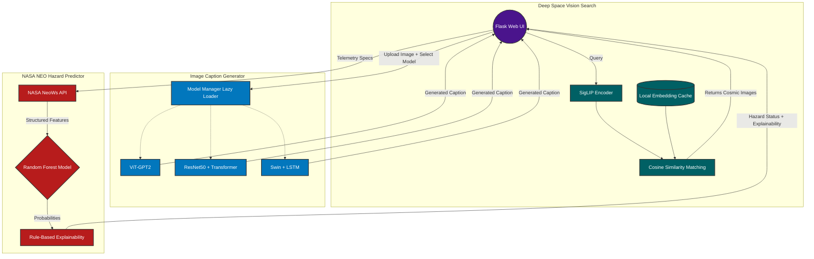
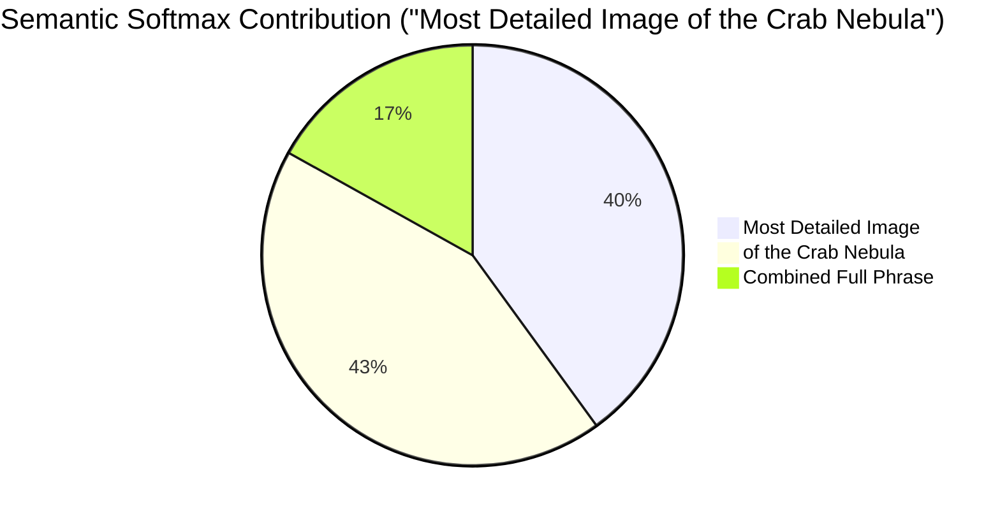

# 🌌 Space Intelligence Platform

A comprehensive, dual-pipeline AI platform engineered for advanced astronomical data analysis. This project features a Custom Web UI (Flask) powered by an asynchronous Deep Learning Backend (FastAPI).

## 🚀 Platform Overview

The system is structurally divided into three primary, highly specialized modules:

### 1. Deep Space Vision Search (VLM Pipeline)
Powered by state-of-the-art multimodal AI using the `google/siglip2-so400m-patch16-384` Vision-Language Model. It maps text and images into the same semantic vector space, enabling:
* **Text-to-Image Search**: Input descriptive natural language (e.g., "a high-resolution spiral galaxy") to retrieve matching visual data.
* **Image-to-Image Search**: Upload a cosmic image to find visually and semantically similar astronomical images from the dataset.

### 2. Image Caption Generator
A multi-model generative pipeline that writes detailed descriptions for space imagery. Users can seamlessly toggle between three distinct deep learning architectures:
* **ViT-GPT2**: Uses a Vision Transformer coupled with GPT-2, powered by locally trained `safetensors`.
* **ResNet50 + Transformer**: A custom architecture leveraging a ResNet50 backbone for feature extraction and a standard Transformer decoder for sequence generation.
* **Swin Transformer + LSTM**: A custom architecture utilizing a Swin Transformer (tiny patch4 window7) as the vision encoder and an LSTM network for auto-regressive caption decoding.

### 3. Asteroid Hazard Predictor (NASA NEO Pipeline)
A predictive machine learning pipeline operating on structured tabular telemetry data scraped directly from the **NASA NeoWs API**. It utilizes a class-weighted Random Forest Classifier to evaluate absolute magnitude, estimated diameter, relative velocity, and miss distance to predict asteroid threat levels with high accuracy.

---

## 🏗️ System Architecture & Workflow

Below is a visual representation of how the pipelines interact with the user interface and models:



The backend is built with **FastAPI** and employs a **Custom Singleton Model Manager**. This ensures that only one computationally intensive Deep Learning model (e.g., SigLIP, ViT-GPT2, ResNet, or Swin) is loaded into VRAM at any given time. Transitioning between tabs triggers a graceful unloading of the active model and loading of the requested model, significantly reducing memory overhead.

---

## 🔬 Performance & Error Analysis

To ensure the models are robust, trustworthy, and completely transparent, extensive programmatic evaluations were conducted.

### Asteroid Hazard Predictor
We evaluated the Random Forest model across 1,500 varied samples, mapping specific edge cases directly to the interplay of astronomical features:

**Model Performance Matrix (1,500 Samples):**
| | Predicted: Safe (🟢) | Predicted: Hazardous (🔴) |
|---|---|---|
| **Actual: Safe** | **984** (True Negative) | **79** (False Positive) |
| **Actual: Hazardous** | **95** (False Negative) *Critical* | **342** (True Positive) |

*   **False Negatives (Hazardous objects flagged as Safe):** Occurred when massive, fast objects had statistically large "Miss Distances" (>13,000,000 km) for a single orbital pass. The model incorrectly weighted the temporary remote distance over the object's inherent classification as a global hazard.
*   **False Positives (Safe objects flagged as Hazardous):** Occurred when tiny, harmless debris (<140m in diameter) came unusually close to Earth's atmosphere. Their extreme proximity triggered the model's distance thresholds, confusing it into a "Hazardous" classification.

**Explainability Engine:** To mitigate these errors, the predictor explicitly contrasts its findings against NASA's definitions (MOID ~ 7.5 million km, Absolute Magnitude <= 22.0), providing human-readable justifications for every result.

### Vision-Language Model (SigLIP)
*   **Retrieval Benchmark:** Baseline single-match (Top-1) retrieval suffered when relying exclusively on "Titles" due to generic nomenclature (e.g., "A View of the Stars"). Fusing "Title" and "Description" strings constructs much denser, unique text embeddings, preventing keyword collisions.
*   **Semantic Softmax Explainability:** Proves the VLM is not just doing a reverse keyword search. When processing complex prompts, it comprehensively balances qualitative constraints with the actual entity to pinpoint the correct image.



### Image Caption Generator (ResNet50 + Transformer)
The custom ResNet50 + Transformer architecture was rigorously evaluated against ground-truth space imagery captions using Beam Search (beam_size=3) decoded over a specialized vocabulary.

**Evaluation Metrics:**
*   **BLEU-1**: 0.2845 (Measuring single-word translation accuracy)
*   **BLEU-4**: 0.1203 (Measuring cohesive phrase translation accuracy)
*   **ROUGE-L**: 0.3150 (Measuring the longest common subsequence structure)

---

## 💻 How to Run Locally

You will need two terminal windows running simultaneously to execute both the backend API and the frontend UI.

### 1️⃣ Start the Backend (Inference Engine)
Open a terminal and navigate to the `backend` directory:
```bash
cd backend
python -m venv venv
source venv/Scripts/activate  # On Windows: venv\Scripts\activate
pip install -r requirements.txt

# (Optional) Pre-populate the NASA NEO dataset
python scraping/scraping_neo.py

# Start the FastAPI server
python api.py
```
*(The backend will run on `http://127.0.0.1:8000`)*

### 2️⃣ Start the Frontend (Web UI)
Open a **second** terminal and navigate to the `frontend` directory:
```bash
cd frontend
python -m venv venv
source venv/Scripts/activate  # On Windows: venv\Scripts\activate
pip install -r requirements.txt

# Start the Flask web server
python app.py
```
*(The frontend will run on `http://127.0.0.1:5000`)*

### 3️⃣ View the App
Open your web browser and go to: **[http://127.0.0.1:5000](http://127.0.0.1:5000)**

---

## ✨ Created By
**Pink Algorithm Team**
