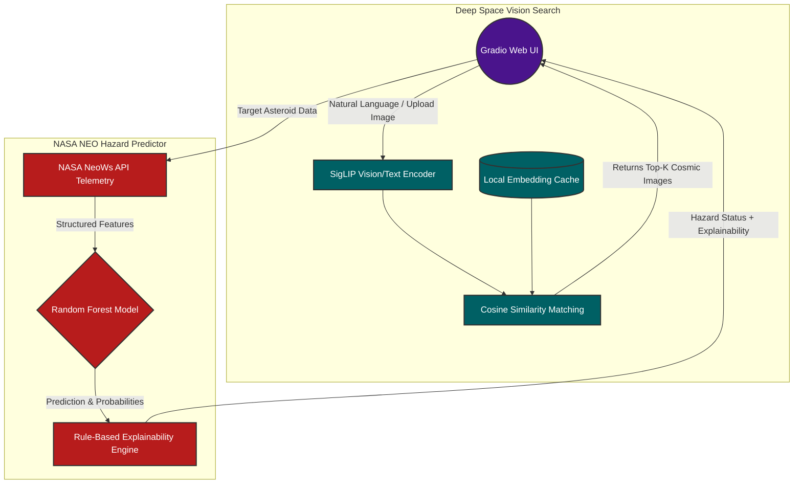
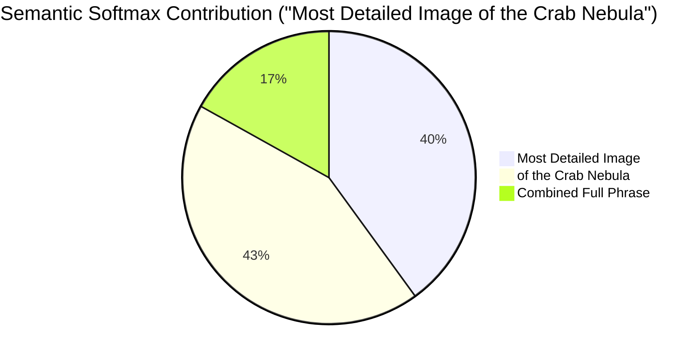

# 🌌 Space Intelligence Platform

## 1. Project Description
The Space Intelligence Platform is a comprehensive, dual-pipeline multimodal system engineered for advanced astronomical data analysis. By unifying unstructured deep space imagery with structured, live planetary transient data, this platform provides a holistic toolkit for researchers and space enthusiasts alike. The system is structurally divided into two primary, highly specialized modules:

*   **Deep Space Vision Search (VLM Pipeline):** 
    Powered by state-of-the-art multimodal AI using the `google/siglip2-so400m-patch16-384` Vision-Language Model. Unlike standard image classifiers, SigLIP leverages contrastive learning to align images and natural language into the same semantic vector space. This module serves as a robust retrieval engine offering two primary modes of interaction:
    *   **Text-to-Image Search**: Users can input highly descriptive natural language queries (e.g., "a high-resolution spiral galaxy" or "the rocky surface of Mars"), and the system maps the text to the closest visual embeddings in the database using cosine similarity.
    *   **Image-to-Image Search**: By uploading an existing space image, the system extracts its visual features and retrieves visually and semantically similar astronomical images from the dataset, alongside their original ground-truth captions.

*   **Asteroid Hazard Predictor (NASA NEO Pipeline):** 
    A predictive machine learning pipeline operating on structured tabular data. It utilizes a class-weighted Random Forest Classifier to identify whether a Near-Earth Object (NEO) is "Potentially Hazardous". 
    *   The model consumes live, real-time telemetry data scraped directly from the **NASA NeoWs (Near Earth Object Web Service) API**. 
    *   It evaluates complex physical and orbital parameters—specifically Absolute Magnitude (H), Estimated Minimum/Maximum Diameter, Relative Velocity, and Miss Distance—to predict asteroid threat levels with high accuracy.

---

## 2. Project Performance & Architecture

Below is a visual representation of how the Dual-Pipeline interacts with the user interface and models:



This platform is deliberately architected to prioritize seamless interactivity, scalable performance, and computational efficiency, proving that deep learning systems can be optimized for instant user feedback:

*   **Instant Search via Zero-Shot VLM Caching (Performance):** 
    Processing hundreds of high-resolution images through a 400-million parameter vision transformer at runtime would cause severe latency. Instead, this platform employs a batched pre-computation architecture. Upon initialization, the system processes the dataset in batches, computes the dense representation of every image, and caches these embeddings locally as a PyTorch tensor (`models/image_embeddings.pt`). During active inference (when a user searches), the system bypasses the heavy vision encoder entirely, performing simple, lightning-fast in-memory matrix multiplications (`torch.matmul`) to calculate cosine similarity. This yields instantaneous, production-ready search results.

*   **Lightweight, Deterministic Explainability Engine:** 
    Standard explainability frameworks like SHAP or LIME introduce massive computational overhead due to their need to iteratively perturb features and compute marginal contributions. For astronomical data governed by strict physics rules, this is inefficient. Instead, we designed a highly optimized, rule-based threshold engine mapped to strict NASA criteria (`HAZARD_THRESHOLDS`). This engine works synergistically with the Random Forest's native `predict_proba()` function. It generates intuitive, SHAP-style, human-readable insights in milliseconds, ensuring real-time UI responsiveness without arbitrary approximations.

*   **Cohesive Dual-Pipeline Integration:** 
    Both the VLM and the predictive models are seamlessly merged into a unified `Gradio` web UI. This allows for a smooth, single-page application experience where users can seamlessly transition between viewing deep space imagery and analyzing the orbital threats of near-earth objects.

---

## 3. Error Analysis and Explainability
To ensure the models are robust, trustworthy, and completely transparent, extensive programmatic evaluations were conducted, transitioning outcomes from "black-box" guesses into explainable insights.

### Asteroid Hazard Predictor (`experiments/error_analysis.py`)
We evaluated the Random Forest model across 1,500 varied samples, mapping specific edge cases directly to the interplay of astronomical features:

**Model Performance Matrix (1,500 Samples):**
| | Predicted: Safe (🟢) | Predicted: Hazardous (🔴) |
|---|---|---|
| **Actual: Safe** | **984** (True Negative) | **79** (False Positive) |
| **Actual: Hazardous** | **95** (False Negative) *Critical* | **342** (True Positive) |

*   **False Negatives (Hazardous objects flagged as Safe):** Our pipeline identified 95 critical failures. Deep analysis revealed that the model occasionally overrides true threat indicators (massive size and extreme velocity) if the object's *specific approaching distance* (Miss Distance for that singular pass) is statistically large (e.g., >13,000,000 km). While the explainability module correctly identified the asteroid's massive diameter, the Random Forest incorrectly weighted the temporary remote distance over the object's inherent classification as a global hazard.
*   **False Positives (Safe objects flagged as Hazardous):** We recorded 79 instances where tiny, harmless debris came unusually close to Earth's atmosphere. Because they represent no mass extinction-level threat (frequently <140m in diameter), NASA marks them as safe. However, their extreme proximity triggered the model's distance thresholds, confusing it into a "Hazardous" classification.

**Explainability Output:** To mitigate these errors, the predictor explicitly contrasts its findings against NASA's definitions (MOID ~ 7.5 million km, Absolute Magnitude <= 22.0). Every prediction prints a human-readable justification, e.g., *"Absolute Magnitude: 18.69 (below threshold of 22.0) — indicates a larger, brighter object"*, ensuring researchers can manually audit the algorithmic logic.

### Vision-Language Model Analysis (`experiments/vlm_analysis.py`)
*   **Retrieval Benchmark (Error Analysis):** We developed a quantitative benchmark to evaluate the retrieval engine's Top-K accuracy. The benchmark uncovered that the baseline single-match (Top-1) retrieval suffers when relying exclusively on text "Titles". Space agency databases frequently utilize generic nomenclature (e.g., "A View of the Stars"). Consequently, the VLM retrieves a visually perfect cosmic scene that—strictly according to the ground-truth metadata—is technically listed as a "miss". 
    *   *Actionable Next Step:* Future iterations will programmatically fuse the "Title" and "Description" strings to construct much denser, unique text embeddings, preventing generic keyword collisions.
*   **Semantic Softmax Explainability:** To trace the VLM's logical processing, we engineered a Semantic Softmax Explainability script. When a user queries a complex prompt like *"Most Detailed Image of the Crab Nebula"*, the script contextually segments the prompt and calculates a probability distribution across the embeddings. It successfully proves that the VLM is not just doing a reverse keyword search; it comprehensively balances qualitative constraints (*"Most Detailed Image"*: ~40% influence) with the actual entity (*"of the Crab Nebula"*: ~43% influence) to pinpoint the exact correct image.



---

## 4. How to Run the Repository

### Prerequisites
Ensure you have Python 3.10+ installed to maintain compatibility with the PyTorch implementations. Install all required dependencies (note: `scikit-learn` is intentionally pinned to v1.5.0 to prevent serialization warnings):
```bash
pip install -r requirements.txt
```

### Step 1: Data Collection & Web Scraping
Before engaging the predictive models, you must populate the datasets. This script reaches out to the NASA NeoWs API, dynamically paginates through the telemetry data, and downloads 1,500 real Near-Earth Objects into your local environment.
```bash
python scraping/scraping_neo.py
```
*(Expected Output: The console will print the pagination status and confirm when the `neo_hazard_dataset.csv` is successfully saved in the `dataset/` directory.)*

### Step 2: Model Training (Hazard Predictor)
Train the Random Forest architecture on the newly scraped astronomical data. This module will automatically split the data, process the features, fit the tree estimators, and output a detailed classification report mapping out precision, recall, and f1-scores.
```bash
python training/train_baseline.py
```
*(Expected Output: An accuracy matrix will print to the terminal, and the finalized model weights will be serialized and saved to `models/neo_rf_model.pkl`.)*

### Step 3: Launch the UI Application
With the models trained and the data prepared, boot up the Gradio web server to interact with both the VLM and the Tabular predictability pipelines in a unified visual interface.
```bash
python demo/app.py
```
*(Expected Output: During the very first launch, you will see a progress bar in your terminal as the SigLIP model pre-computes the initial image embeddings. Once complete, it will provide a local URL—typically `http://127.0.0.1:7860`—which you can open in any web browser to experience the platform.)*
